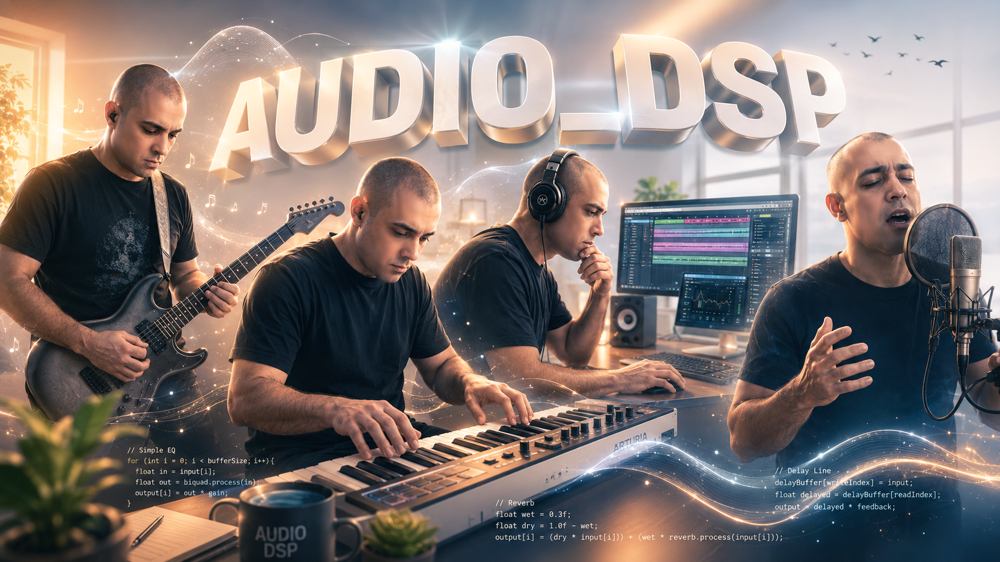

<p align="center">
  
</p>

# AUDIO_DSP

**AUDIO_DSP** é uma biblioteca C++20 de processamento digital de áudio em tempo real, organizada principalmente no namespace `cvdsp` e pensada para plugins, instrumentos, pedais virtuais, ferramentas espectrais, protótipos de áudio e motores DSP próprios.

O núcleo da biblioteca fica em `CV_DSP/` e foi desenhado para ser usado diretamente por inclusão de headers. O repositório também inclui exemplos DSP puros, exemplos VST3, uma camada de GUI opcional (`CV_GUI/`) e backends/vendor SDKs usados pelos exemplos de plugin.

> Versão atual declarada no código: **0.1.0**.

---

## Sumário

- [O que a biblioteca faz](#o-que-a-biblioteca-faz)
- [Principais elementos](#principais-elementos)
- [Aplicações e softwares compatíveis](#aplicações-e-softwares-compatíveis)
- [Filosofias do projeto](#filosofias-do-projeto)
- [Métricas de código](#métricas-de-código)
- [Estrutura do repositório](#estrutura-do-repositório)
- [Instalação](#instalação)
- [Como usar em C++](#como-usar-em-c)
- [Como compilar exemplos DSP puros](#como-compilar-exemplos-dsp-puros)
- [Como compilar exemplos VST3](#como-compilar-exemplos-vst3)
- [Instalação dos plugins VST3 gerados](#instalação-dos-plugins-vst3-gerados)
- [GUI e fallback](#gui-e-fallback)
- [Licença](#licença)

---

## O que a biblioteca faz

A AUDIO_DSP fornece blocos de DSP para construir efeitos, instrumentos, analisadores e plugins de áudio. Ela cobre desde utilidades fundamentais, como buffers circulares e suavização de parâmetros, até processadores completos para guitarra, reverberação, dinâmica, filtros, saturação e processamento espectral.

A biblioteca pode ser usada em dois níveis:

1. **DSP puro / engine própria**: incluir os headers de `CV_DSP/` em qualquer aplicação C++20, engine de áudio, ferramenta offline, programa de teste ou protótipo.
2. **Plugins VST3**: usar os exemplos de `examples/*_vst3` e `examples/pedais/*_vst3` como base para plugins compatíveis com hosts/DAWs que suportam VST3.

---

## Principais elementos

### Core

Componentes fundamentais para processamento seguro e previsível:

- `AudioBufferView`: visualização leve de buffers de áudio.
- `CircularBuffer`: buffer circular para delay lines e efeitos em tempo real.
- `ParameterSmoother`: suavização linear, exponencial ou de um polo para automação sem clicks.
- `ProcessContext`, `Types`, `Constants`, `DSPUtils`, `Config` e `Version`: tipos, políticas e metadados comuns.

### Matemática e utilidades

- `FastMath`: aproximações e utilidades matemáticas.
- `Interpolation`: interpolação para leitura fracionária e processamento de sinais.
- `LookupTable`: tabelas de consulta para acelerar funções.
- `Oversampling`: suporte para oversampling em processadores não lineares.

### Filtros

- `Biquad`: filtros clássicos com coeficientes biquad.
- `OnePoleFilter`: filtro simples de um polo.
- `StateVariableFilter`: filtro multimodo baseado em variável de estado.
- `LadderFilter`: filtro estilo ladder.
- `AllPassFilter`: filtro all-pass para fase, phaser e reverbs.
- `DCBlocker`: remoção de offset DC.

### Delay, modulação e efeitos

- `DelayLine`: delay fracionário com interpolação.
- `LFO`: oscilador de baixa frequência para modulação.
- `Oscillator`: oscilador de uso geral.
- `ADSR`: envelope de ataque, decaimento, sustentação e release.
- `Chorus`, `Flanger` e `Phaser`: efeitos modulados prontos para uso.

### Dinâmica

- `EnvelopeFollower`: seguidor de envelope.
- `Compressor`: controle de faixa dinâmica.
- `Limiter`: limitação de picos.
- `NoiseGate`: gate de ruído.
- `Expander`: expansão dinâmica.

### EQ e espacialização

- `Equalizer`, `GraphicEQ` e `ParametricEQ`: equalização gráfica e paramétrica.
- `MidSide`: codificação/decodificação mid-side.
- `StereoWidth`: controle de largura estéreo.

### Saturação e timbre

- `TubeSaturation`: saturação inspirada em válvulas.
- `TapeSaturation`: saturação inspirada em fita.
- `Waveshaper`: waveshaping customizável.
- `ToneStack`: estágios tonais para modelagem de timbre.

### Guitarra, amplificadores e pedais

- `AmpSimulator`, `TubePreamp`, `PowerAmp`, `CabinetSimulator`: blocos para simulação de amplificador.
- Tone stacks: `FenderToneStack`, `MarshallToneStack`, `MesaToneStack`, `VoxToneStack`.
- Estágios de válvula: `TriodeStage` e `PentodeStage`.
- Pedais: `ClassicOverdriveDSP`, `VintageHardDistortionDSP`, `VintageFuzzDSP`, `ChainsawMetalDSP`, `SustainerDSP`, `PhaserDSP` e `WahWahDSP`.
- Utilidades internas de pedais: clippers, filtros pré/pós, estágios de ganho, mix e descritores de parâmetros.

### Reverberação e convolução

- Reverbs algorítmicos: `RoomReverb`, `HallReverb`, `PlateReverb`, `SpringReverb`, `SuperReverb`, `DeluxeReverb` e `TwinReverb`.
- Convolução: `ConvolutionEngine` e `IRLoader` para fluxos baseados em impulse responses.

### Processamento espectral

- `FFT`: transformada rápida de Fourier.
- `STFT`: análise/processamento por short-time Fourier transform.
- `WindowFunctions`: janelas para análise espectral.
- `SpectrumAnalyzer`: análise de espectro.
- `SpectralNoiseReducer` e `RealtimeNoiseReducer`: redução de ruído por perfil espectral.

### Síntese e controle

- `BassFingerVoice`: voz de baixo fingerstyle leve.
- `ExpressionEngine`: motor de expressão para automação, pedal de expressão e mapeamentos.
- `ParameterManager`, `ParameterState`, `ParameterDescriptor`, `MidiEvent` e `MonoNoteTracker`: infraestrutura de parâmetros, MIDI e tracking monofônico.

### Adapters e GUI

- `CV_DSP/Adapters/VST3`: adaptadores para buffers, parâmetros e contexto VST3.
- `CV_GUI/`: camada opcional baseada em Dear ImGui/OpenGL/Win32 quando disponível.
- Fallback de GUI: os exemplos VST3 podem retornar `nullptr` em `createView()` para permitir que a DAW use o editor genérico de parâmetros.

---

## Aplicações e softwares compatíveis

A biblioteca serve para:

- Plugins de áudio VST3.
- Pedais virtuais de guitarra e baixo.
- Simuladores de amplificador e caixas.
- Canais de gravação com gate, compressor, saturação, EQ e reverb.
- Redução de ruído em tempo real.
- Analisadores espectrais.
- Sintetizadores e instrumentos virtuais simples.
- Ferramentas offline de processamento de áudio.
- Engines de jogos, instalações interativas e aplicações C++ próprias.
- Prototipagem de algoritmos DSP sem depender de uma DAW.

### DAWs e hosts

Os exemplos VST3 são direcionados a hosts compatíveis com **VST3**, incluindo, em princípio:

- REAPER.
- Cubase / Nuendo.
- Studio One.
- Ableton Live.
- FL Studio.
- Bitwig Studio.
- WaveLab.
- Hosts de teste VST3 e DAWs que façam rescan de plugins `.vst3`.

### Frameworks e integrações possíveis

O código DSP puro pode ser integrado em projetos baseados em:

- VST3 SDK direto.
- JUCE.
- iPlug2.
- RtAudio/PortAudio.
- SDL/engines próprias.
- Aplicações de linha de comando para renderização offline.
- Sistemas embarcados ou ferramentas customizadas, desde que atendam aos requisitos de C++ e plataforma.

---

## Filosofias do projeto

A AUDIO_DSP segue algumas ideias centrais:

1. **Tempo real em primeiro lugar**
   Código de áudio deve evitar alocação dinâmica, exceções e operações imprevisíveis dentro de `process()`.

2. **DSP independente de GUI e host**
   O algoritmo deve funcionar sem depender de VST3, DAW ou interface gráfica. O plugin é uma camada em volta do DSP, não o contrário.

3. **Header-only quando possível**
   Os blocos principais de `CV_DSP/` são distribuídos como headers para facilitar inclusão, testes e reaproveitamento.

4. **Parâmetros suaves**
   Mudanças de parâmetros devem ser suavizadas para evitar clicks, zipper noise e saltos audíveis.

5. **Modularidade**
   Filtros, delays, envelopes, saturações e managers são peças reutilizáveis para construir cadeias maiores.

6. **Fallback pragmático**
   Quando uma GUI customizada não estiver disponível, o DSP deve continuar utilizável via editor genérico do host.

7. **Exemplos compiláveis**
   O repositório mantém exemplos DSP puros e projetos VST3 para validar uso real, smoke tests e integração com DAWs.

8. **Portabilidade**
   O projeto mira Linux, Windows e macOS com C++20, CMake e uma separação clara entre código próprio e dependências externas.

---

## Métricas de código

Métricas aproximadas da árvore atual, desconsiderando código vendor em `backends/` para as métricas first-party principais:

| Área | Arquivos medidos | Linhas aproximadas |
| --- | ---: | ---: |
| `CV_DSP/` | 99 | 35.219 |
| `CV_GUI/` | 18 | 2.264 |
| `examples/` | 521 | 39.176 |
| Código C/C++ first-party fora de `backends/` | 510 | 64.002 |

Outros indicadores:

- **94 headers `.hpp`** em `CV_DSP/`.
- **55 projetos com `CMakeLists.txt`** dentro de `examples/`.
- **65 READMEs** dentro de `examples/`.
- Licença MIT.
- C++20 como padrão usado nos exemplos modernos.
- VST3 SDK bundled em `backends/vst3sdk` para os exemplos de plugin.
- Dear ImGui bundled em `backends/imgui` para a camada GUI opcional.
- TinySoundFont bundled em `backends/TinySoundFont` para fluxos relacionados a SoundFont/MIDI quando aplicável.

Comando usado para gerar essas métricas localmente:

```bash
python3 - <<'PY'
from pathlib import Path
roots = [Path('CV_DSP'), Path('CV_GUI'), Path('examples')]
exts = {'.hpp', '.h', '.cpp', '.c', '.md', '.txt', '.cmake'}
for root in roots:
    files = [p for p in root.rglob('*') if p.is_file() and p.suffix in exts]
    loc = sum(sum(1 for _ in p.open('r', encoding='utf-8', errors='ignore')) for p in files)
    print(root, len(files), loc)
PY
```

---

## Estrutura do repositório

```text
AUDIO_DSP/
├── AUDIO_DSP_CAPA.png              # Capa do repositório
├── CV_DSP/                         # Biblioteca DSP principal
│   ├── Core/                       # Tipos, buffers, suavização, contexto e versão
│   ├── Math/                       # Matemática, interpolação, lookup e oversampling
│   ├── Filters/                    # Filtros digitais
│   ├── Delay/                      # Delay line fracionária
│   ├── Modulation/                 # LFO, oscilador e ADSR
│   ├── Effects/                    # Chorus, flanger e phaser
│   ├── Dynamics/                   # Compressor, limiter, gate, expander e envelope follower
│   ├── EQ/                         # Equalizadores
│   ├── Saturation/                 # Saturações e waveshaping
│   ├── Reverb/                     # Reverbs algorítmicos
│   ├── Spectral/                   # FFT, STFT, análise e redução de ruído
│   ├── Spatial/                    # Mid-side e largura estéreo
│   ├── Guitar/                     # Amps, tone stacks, cab sim e pedais
│   ├── Synthesis/                  # Vozes/instrumentos
│   ├── Control/                    # Expression engine
│   ├── Manager/                    # Parâmetros, estado e MIDI
│   └── Adapters/VST3/              # Pontes para VST3
├── CV_GUI/                         # GUI opcional para plugins
├── examples/                       # Smoke tests, exemplos DSP puros e VST3
├── backends/                       # Dependências bundled usadas pelos exemplos
├── AUDIO_DSP_DOCUMENTATION.pdf     # Documentação adicional em PDF
└── LICENSE                         # MIT
```

---

## Instalação

### Requisitos gerais

- Compilador com suporte a **C++20**:
  - GCC 10+ ou Clang 12+ no Linux.
  - MSVC 2019/2022 no Windows.
  - Apple Clang recente no macOS.
- CMake 3.14+ para compilar os exemplos VST3.
- Git para clonar o repositório.
- Uma DAW/host compatível com VST3 se você quiser testar os plugins.

### Linux

```bash
git clone <URL_DO_REPOSITORIO> AUDIO_DSP
cd AUDIO_DSP
```

Para usar apenas a biblioteca DSP em outro projeto, adicione a raiz do repositório ao include path:

```bash
c++ -std=c++20 -I/path/para/AUDIO_DSP meu_programa.cpp -o meu_programa
```

Para compilar exemplos VST3, instale as ferramentas básicas da sua distribuição. Exemplo em Debian/Ubuntu:

```bash
sudo apt update
sudo apt install build-essential cmake git
```

Depois compile um exemplo:

```bash
cmake -S examples/chorus_vst3 -B /tmp/chorus_vst3_build
cmake --build /tmp/chorus_vst3_build
```

### Windows

1. Instale **Visual Studio 2022** com o workload **Desktop development with C++**.
2. Instale **CMake** e **Git**.
3. Clone o repositório:

```powershell
git clone <URL_DO_REPOSITORIO> AUDIO_DSP
cd AUDIO_DSP
```

Para usar o DSP puro em um projeto MSVC, adicione a pasta raiz `AUDIO_DSP` em **Additional Include Directories**.

Para compilar um plugin VST3 com CMake:

```powershell
cmake -S examples\chorus_vst3 -B build\chorus_vst3 -G "Visual Studio 17 2022" -A x64
cmake --build build\chorus_vst3 --config Release
```
Para compilar com Ming64

```cmd
mkdir build
cd build
cmake -G "MinGW Makefiles" ..
ming32-make
se quiser adicione -4 ou o numero de processadores que vc estiver disponível para usar na compilação
no caso : ming32-make -j4 (por exemplo)
```
### macOS

1. Instale Xcode Command Line Tools:

```bash
xcode-select --install
```

2. Instale CMake, por exemplo com Homebrew:

```bash
brew install cmake git
```

3. Clone e compile:

```bash
git clone <URL_DO_REPOSITORIO> AUDIO_DSP
cd AUDIO_DSP
cmake -S examples/chorus_vst3 -B /tmp/chorus_vst3_build
cmake --build /tmp/chorus_vst3_build
```

### Outros sistemas / engines próprias

Como `CV_DSP/` é essencialmente C++20 header-first, o caminho mínimo é:

1. Copiar ou submodule o repositório.
2. Adicionar a raiz de `AUDIO_DSP` ao include path.
3. Incluir os headers necessários com caminho completo, por exemplo `#include "CV_DSP/Filters/Biquad.hpp"`.
4. Chamar `prepare()`, configurar parâmetros e processar amostras/blocos no callback da sua engine.

---

## Como usar em C++

### Exemplo 1 — filtro biquad simples

```cpp
#include "CV_DSP/Filters/Biquad.hpp"

int main()
{
    cvdsp::filters::Biquad<float> filter;
    filter.prepare(48000.0f);
    filter.setType(cvdsp::filters::BiquadType::LowPass);
    filter.setFrequency(1000.0f);
    filter.setQ(0.707f);
    filter.updateCoefficients();

    float input = 0.25f;
    float output = filter.process(input);
    (void)output;
    return 0;
}
```

Compilação:

```bash
c++ -std=c++20 -Wall -Wextra -Wpedantic -I. exemplo_biquad.cpp -o exemplo_biquad
```

### Exemplo 2 — chorus com delay line e LFO

```cpp
#include <cstddef>
#include "CV_DSP/Delay/DelayLine.hpp"
#include "CV_DSP/Modulation/LFO.hpp"

void processChorus(const float* input, float* output, std::size_t blockSize)
{
    cvdsp::delay::DelayLine<float, 16384, cvdsp::delay::InterpolationType::Linear> delay;
    delay.prepare(48000.0f);

    cvdsp::modulation::LFO<float> lfo;
    lfo.prepare(48000.0f, 2.5f, 1.0f, cvdsp::modulation::LFOWaveform::Sine);

    for (std::size_t n = 0; n < blockSize; ++n) {
        const float mod = lfo.process();
        const float delayMs = 40.0f + mod * 10.0f;
        delay.setDelayMilliseconds(delayMs);
        output[n] = input[n] + 0.7f * delay.process(input[n]);
    }
}
```

### Exemplo 3 — compressor com automação suave

```cpp
#include <cstddef>
#include "CV_DSP/Core/ParameterSmoother.hpp"
#include "CV_DSP/Dynamics/Compressor.hpp"

void processCompression(const float* input, float* output, std::size_t blockSize)
{
    cvdsp::dynamics::Compressor<float> compressor;
    compressor.prepare(48000.0f);
    compressor.setRatio(3.0f);
    compressor.setAttackMs(10.0f);
    compressor.setReleaseMs(120.0f);
    compressor.setKneeDB(6.0f);
    compressor.setMakeupGainDB(3.0f);

    // Rampa de 10 ms em 48 kHz para evitar clicks em automação.
    cvdsp::LinearSmoother<float> threshold;
    threshold.prepare(48000.0f, 0.010f);
    threshold.reset(-12.0f);
    threshold.setTarget(-20.0f, 480);

    for (std::size_t n = 0; n < blockSize; ++n) {
        compressor.setThresholdDB(threshold.process());
        output[n] = compressor.process(input[n]);
    }
}
```

### Exemplo 4 — redutor de ruído espectral

```cpp
#include "CV_DSP/Spectral/SpectralNoiseReducer.hpp"

int main()
{
    cvdsp::spectral::SpectralNoiseReducer<float> reducer;
    reducer.prepare(48000.0f);
    reducer.setReductionAmount(0.7f);
    reducer.setSmoothing(0.5f);
    return 0;
}
```

Consulte `examples/spectral_noise_reducer_dsp/` e `examples/spectral_noise_reducer_vst3/` para fluxos completos com captura de perfil de ruído, smoke test, benchmark e plugin.

---

## Como compilar exemplos DSP puros

Os exemplos DSP puros não precisam de DAW nem VST3 SDK. Eles validam includes, `prepare/reset`, processamento básico e ausência de `NaN/Inf`.

Da raiz do repositório:

```bash
c++ -std=c++20 -Wall -Wextra -Wpedantic -I. examples/expression_engine_dsp/expression_engine_smoke.cpp -o /tmp/expression_engine_smoke && /tmp/expression_engine_smoke
c++ -std=c++20 -Wall -Wextra -Wpedantic -I. examples/phaser_dsp/phaser_smoke.cpp -o /tmp/phaser_smoke && /tmp/phaser_smoke
c++ -std=c++20 -Wall -Wextra -Wpedantic -I. examples/sustainer_dsp/sustainer_smoke.cpp -o /tmp/sustainer_smoke && /tmp/sustainer_smoke
c++ -std=c++20 -Wall -Wextra -Wpedantic -I. examples/wah_wah_dsp/wah_wah_smoke.cpp -o /tmp/wah_wah_smoke && /tmp/wah_wah_smoke
c++ -std=c++20 -Wall -Wextra -Wpedantic -I. examples/guitar_pedalboard_dsp/guitar_pedalboard_smoke.cpp -o /tmp/guitar_pedalboard_smoke && /tmp/guitar_pedalboard_smoke
```

Rodar todos os smoke tests novos e o benchmark spectral:

```bash
examples/run_new_dsp_smokes.sh
```

Compilar o benchmark do redutor de ruído:

```bash
cmake -S examples/spectral_noise_reducer_dsp -B /tmp/spectral_noise_reducer_dsp_build
cmake --build /tmp/spectral_noise_reducer_dsp_build --target realtime_noise_reducer_benchmark
/tmp/spectral_noise_reducer_dsp_build/realtime_noise_reducer_benchmark
```

---

## Como compilar exemplos VST3

Cada exemplo VST3 tem seu próprio `CMakeLists.txt`. O padrão é compilar fora da árvore do repositório.

### Build individual

```bash
cmake -S examples/chorus_vst3 -B /tmp/chorus_vst3_build
cmake --build /tmp/chorus_vst3_build
```

Troque `chorus_vst3` por qualquer outro exemplo, como:

- `biquad_filter_vst3`
- `compressor_vst3`
- `limiter_vst3`
- `noise_gate_vst3`
- `tape_saturation_vst3`
- `tube_saturation_vst3`
- `waveshaper_vst3`
- `plate_reverb_vst3`
- `hall_reverb_vst3`
- `room_reverb_vst3`
- `spring_reverb_vst3`
- `fft_vst3`
- `stft_vst3`
- `spectral_noise_reducer_vst3`
- `amp_simulator_vst3`
- `tube_preamp_vst3`
- `marshall_tone_vst3`
- `fender_tone_vst3`
- `vox_tone_vst3`
- `cv_bass_finger_lite_vst3`
- `cv_gm_instrument_lite_vst3`

### Build de todos os pedais VST3

Os pedais ficam em `examples/pedais/` e têm um helper próprio:

```bash
examples/pedais/build_all_pedals.sh
```

Build com pasta customizada:

```bash
examples/pedais/build_all_pedals.sh /tmp/minha_build_pedais
```

Pedais incluídos no helper:

- `classic_overdrive_vst3`
- `vintage_hard_distortion_vst3`
- `vintage_fuzz_vst3`
- `chainsaw_metal_vst3`
- `sustainer_vst3`
- `phaser_vst3`
- `wah_wah_vst3`

Build individual de um pedal:

```bash
cmake -S examples/pedais/wah_wah_vst3 -B /tmp/wah_wah_vst3_build
cmake --build /tmp/wah_wah_vst3_build --target wah_wah_vst3
```

---

## Instalação dos plugins VST3 gerados

Copie a pasta `.vst3` inteira gerada pelo build, não apenas a biblioteca interna (`.so`, `.dll` ou `.dylib`). Depois peça para a DAW fazer rescan dos plugins.

### Linux

Local comum por usuário:

```bash
mkdir -p ~/.vst3
cp -R /tmp/chorus_vst3_build/VST3/chorus_vst3.vst3 ~/.vst3/
```

Para pedais compilados pelo helper, o artefato costuma ficar em:

```text
/tmp/cv_dsp_pedais_vst3_build/<plugin>/VST3/<plugin>.vst3
```

Exemplo:

```bash
mkdir -p ~/.vst3
cp -R /tmp/cv_dsp_pedais_vst3_build/wah_wah_vst3/VST3/wah_wah_vst3.vst3 ~/.vst3/
```

### Windows

Locais comuns:

```text
C:\Program Files\Common Files\VST3
%LOCALAPPDATA%\Programs\Common\VST3
```

Copie a pasta `.vst3` gerada pelo CMake para um desses locais e faça rescan na DAW.

### macOS

Locais comuns:

```text
~/Library/Audio/Plug-Ins/VST3
/Library/Audio/Plug-Ins/VST3
```

Exemplo:

```bash
mkdir -p ~/Library/Audio/Plug-Ins/VST3
cp -R /tmp/chorus_vst3_build/VST3/chorus_vst3.vst3 ~/Library/Audio/Plug-Ins/VST3/
```

---

## GUI e fallback

Os exemplos VST3 podem tentar usar `CV_GUI` quando o backend da plataforma estiver habilitado. Quando a GUI customizada não está disponível, a estratégia do projeto é permitir que `createView()` retorne `nullptr`. Assim, hosts como REAPER e outras DAWs podem abrir o editor genérico/nativo de parâmetros e o DSP continua utilizável.

Essa filosofia separa três camadas:

1. **DSP**: algoritmo, estado e parâmetros.
2. **Adapter/plugin**: integração VST3, automação, buses e metadados.
3. **GUI**: camada opcional, substituível e não obrigatória para validar o áudio.

---

## Boas práticas ao contribuir

- Prefira includes diretos com o caminho `CV_DSP/...`.
- Evite alocações no caminho de áudio em tempo real.
- Chame `prepare(sampleRate)` antes de processar áudio.
- Use suavização para parâmetros automatizados.
- Mantenha exemplos pequenos e compiláveis.
- Teste DSP puro antes de testar dentro da DAW.
- Documente parâmetros audíveis, faixas e valores default.
- Não misture lógica essencial de DSP com GUI.

---

## Licença

Este projeto é distribuído sob a licença **MIT**. Consulte `LICENSE` para o texto completo.
